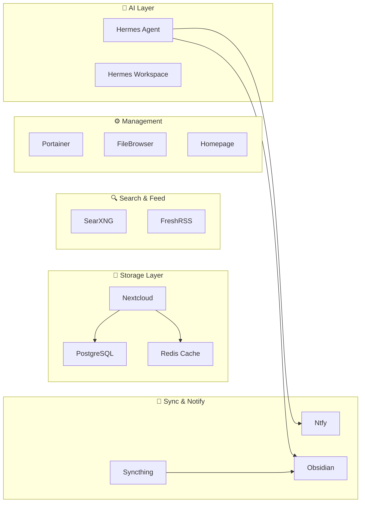

# 📦 Apps

All the self-hosted apps running on my server. Every one is open source and runs in Docker.

  

    ☁️
    <h3>Nextcloud</h3>
    
My personal Dropbox — files, photos, contacts, calendar. PostgreSQL + Redis backend with auto-maintenance.

    
Cloud StoragePostgreSQL

  

  

    🤖
    <h3>Hermes Agent</h3>
    
Autonomous AI agent by Nous Research. Runs 24/7 — monitoring, reports, research, Telegram integration.

    
AIAutomation

  

  

    🔍
    <h3>SearXNG</h3>
    
Private meta-search engine. Queries Google, DuckDuckGo, Wikipedia, etc. — no tracking, no logs, no profiling.

    
SearchPrivacy

  

  

    📰
    <h3>FreshRSS</h3>
    
RSS feed reader. Follows blogs, news sites, and creators. Works with FeedMe app on Android.

    
RSSReader

  

  

    🏠
    <h3>Homepage</h3>
    
Customizable dashboard that auto-discovers Docker containers and shows live status.

    
Dashboard

  

  

    📝
    <h3>Obsidian</h3>
    
Note-taking vault in a container. Accessible from any browser, synced via Syncthing. Hermes writes to it too.

    
NotesSyncthing

  

  

    🔔
    <h3>Ntfy</h3>
    
Push notification server. Simple HTTP API — every cron job and script can alert my phone.

    
Notifications

  

  

    🔄
    <h3>Syncthing</h3>
    
Decentralized P2P file sync. No cloud — devices sync directly. Keeps vault, photos, and docs in sync.

    
SyncP2P

  

  

    📸
    <h3>PiGallery2</h3>
    
Self-hosted photo gallery. Scans directories and generates thumbnails automatically.

    
GalleryPhotos

  

  

    🐳
    <h3>Portainer</h3>
    
Docker management UI. View containers, logs, volumes, and networks without SSH.

    
DockerManagement

  

  

    📁
    <h3>FileBrowser</h3>
    
Web-based file manager. Upload, download, preview files from any browser.

    
Files

  

  

    🎮
    <h3>Epic Games Claimer</h3>
    
Auto-claims free Epic Games weekly. Runs on schedule, notifies when claimed.

    
AutomationGaming

  

  

    💻
    <h3>Hermes Workspace</h3>
    
Browser-based dev environment with editor and terminal. Code from any device.

    
IDEWeb

  

---

## How they connect

