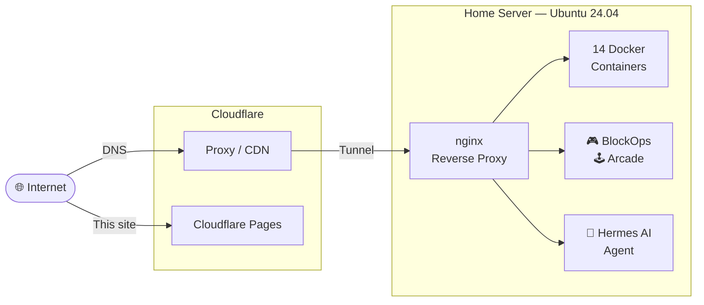

  <h1>🚀 What I Run</h1>
  
This is my home server — an Ubuntu box running 14 containers, game servers, an AI agent, and everything in between. Built for fun, runs 24/7.

  

    

      14
      Containers
    

    

      99.9%
      Uptime
    

    

      64 GB
      RAM
    

    

      8+
      Projects
    

  

## How it all connects

## What I use it for

  

    ☁️
    <h3>Cloud Storage</h3>
    
Nextcloud with 1.9 TB storage — my own Dropbox, no subscription needed.

  

  

    🔍
    <h3>Private Search</h3>
    
SearXNG — aggregated search results with zero tracking or profiling.

  

  

    🎮
    <h3>Game Servers</h3>
    
Retro emulator arcade + browser-based FPS. Play with friends.

  

  

    🤖
    <h3>AI Agent</h3>
    
Hermes Agent — automates tasks, monitors the server, runs on a schedule.

  

  

    📰
    <h3>RSS Reader</h3>
    
FreshRSS — follows blogs and news feeds, always synced.

  

  

    🔄
    <h3>File Sync</h3>
    
Syncthing keeps files in sync across all my devices without a cloud provider.

  

  

    📸
    <h3>Photo Gallery</h3>
    
PiGallery2 — self-hosted photo gallery with albums and sharing.

  

  

    🔔
    <h3>Notifications</h3>
    
ntfy pushes alerts to my phone when something needs attention.

  

  

    🗂️
    <h3>File Browser</h3>
    
Web-based file manager for quick uploads and downloads.

  

---

## Explore

  <a href="apps/">📦 Apps</a>
  <a href="projects/">🚀 Projects</a>
  <a href="tech-stack/">🛠️ Tech Stack</a>

