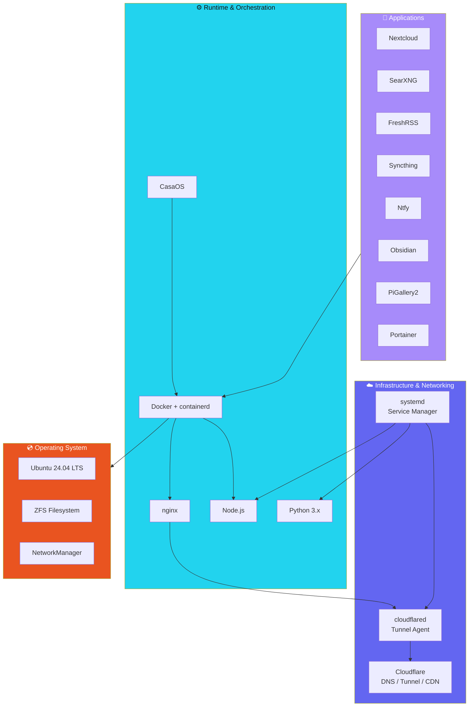

# 🛠️ Tech Stack

What makes this server tick — from the OS right up to the application layer.

## Operating System & Hardware

  

    
OS

    
Ubuntu 24.04 LTS

  

  

    
CPU

    
AMD Ryzen 5 5600G

  

  

    
RAM

    
64 GB DDR4

  

  

    
GPU

    
RTX 4060 Ti

  

## Runtime & Cloud

  

    🐳
    Docker
  

  

    🪟
    CasaOS
  

  

    🔀
    nginx
  

  

    💚
    Node.js
  

  

    🐍
    Python
  

  

    🔶
    Cloudflare
  

  

    🔗
    cloudflared
  

  

    ⚡
    Hermes Agent
  

  

    📦
    systemd
  

  

    🗄️
    PostgreSQL
  

  

    🔥
    Redis
  

  

    🔌
    Socket.io
  

  

    🌐
    EmulatorJS
  

  

    📊
    MkDocs Material
  

---

### Key Principles

- ✅ **Open source first** — Every app is free and open source software
- 🔒 **Self-hosted** — No third-party cloud dependencies for core services
- ⚡ **Automation** — Cron jobs handle backups, updates, monitoring
- 🔄 **Redundancy** — Docker volumes backed up daily, Syncthing mirrors critical data
- 🛡️ **Cloudflare** — DNS, CDN, DDoS protection, and tunnel for secure access
